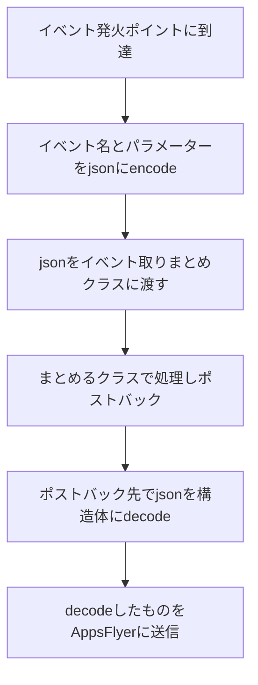

## はじめに

みてねのCREグループでエンジニアをしているこすげです。

この記事ではAppsFlyerに送っているイベントのパラメーターのvalueが全てnullになっていて計測できていない問題に気がつき、対応したことについて書きました。

同じような問題に直面している人だったり、同じような実装をしている人の気づきになれたらいいなと思います。

### 前提知識

#### AppsFlyer

AppsFlyerは、モバイルアプリのインストールやイベントを計測・分析できるモバイル計測プラットフォームです。

https://www.appsflyer.com/

ある広告経由からインストールしたユーザーがどのような行動をしているかを計測することができます。

## 対応することになったきっかけ

ある日、新規ユーザー獲得をKPIに置いているチームから「AppsFlyerに新しくイベントを送信するように実装してほしい」との依頼が来ました。

CREグループとしてもAppsFlyerの実装依頼は初めてで現状の把握もできていなかったため、iOS / Android共に既存のイベントが計測ができているかどうかの調査から進めることにしました。

そこでコードベースで調査したところ、依頼してきたチームがまとめていたドキュメントと少し食い違う部分が見つかりました。

それがイベント送信はされているけど、パラメーターがnullになってしまっていて、計上されていないという点でした。

コード上は問題なさそう、もし仮にパラメーターとして送る際に参照している値がnullになっている場合、後続の処理が実行されず致命的な不具合を起こすものでした。

ただ、そういったお問い合わせは特になくnullな状態であることは考えられない、けど実際にAppsFlyerの管理画面で見るとnullになってしまっているという状態でした。

```json
{
    "key": "value",
    "count": 3
}
```

みたいに送っているはずが、AppsFlyerの管理画面からレポートをダウンロードすると

```json
{
    "key": null,
    "count": null
}
```

という状態になっていました。

ありえないけど、起きてしまっていること、そのパラメーターが計上できないと正確な数字が測れないこともあり、対応を進めることにしました。

## 調査した内容

どんなことを調査したのか書いていきます。

### 既存のそのほかのイベントでも同じようにvalueがnullになっているかどうか

今回気がついたイベント以外にもパラメーターを送っているイベントがあったので、それら全てがnullになっているのかどうかを調べました。

もしこれでnullになっていない場合は気がついたイベントを送信するところの問題として切り分けられるからです。

結果は全てのイベントのパラメーターのvalueがnullになっていました。

このイベントのパラメーターの値は文字列以外にもint, floatやbooleanなど様々な型で送っていましたが、全てnullになっていました。

### どこの段階でnullになっているか

イベント送信するところの処理は以下のようになっています。



jsonをencodeしてdecodeしてるところが怪しいかなと思いつつ、上記の全てのpointでprint debugしましたが、どこの時点でもnullになっていませんでした。

イベント名とパラメーターをまとめた構造体は以下のようにしています（だいぶサンプルです）

```kotlin
@Serializable
data class EventData(
    val eventName: String,
    val params: JsonObject,
)
```

どこで見てもnullにはならないのですが、アプリのログを見るとAppsFlyerのSDKがHTTPリクエストを送信してるログではnullになっています。

```shell
xxx-xx-xx xx:xx:xx.xxx  1234-5678  AppsFlyer_6.16.2        com.example.development                I  [Other] INAPP-11: preparing data: {...だいぶ省略...,"eventValue":"{\"key\":null,\"hoge\":null,\"fuga\":null}",...だいぶ省略...}
```

AppsFlyerSDKのコードは公開されていないので、どのようなデコード処理をしているかわかりませんでした...。

ただAppsFlyerSDKに送るところまではしっかり情報が残っていることがわかったので、AppsFlyerSDKに渡すパラメーターを調整すれば良さそうなことがわかりました。

### どういったデータを渡したらnullにならないか

これはすぐにわかりました。

以下のようにしたところ、nullになりませんでした。

```kotlin
appsFlyerLib.logEvent(context, data.eventName, mapOf("test_key" to "test_value"))
```

appsFlyerLibはAppsFlyerSDKが用意してくれているものですが、 logEvent をcallすることでログ送信ができます。

上記のように `mapOf()` で渡したところ以下のようにログが出ました。

```shell
xxx-xx-xx xx:xx:xx.xxx  1234-5678  AppsFlyer_6.16.2        com.example.development                I  [Other] INAPP-11: preparing data: {...だいぶ省略...,"eventValue":"{\"test_key\":\"test_value\"}"...だいぶ省略...}
```

しっかり `test_value` が送られていることがわかりました。

ちなみに `appsFlyerLib` の `logEvent` は以下のように型が定義されています。

```java
    public abstract void logEvent(Context var1, String var2, Map<String, Object> var3);
```

となると、アプリ内で用意してる `val params: JsonObject` をそのまま渡すとnullにされてしまうのかな？と考え javaで言う `java.util.Map<String, Object>`、kotlinで言う `Map<String, Any>` に型変換すると良さそうなことがわかりました。

なので、`JsonObject` を `Map<String, Any>` に変換するコードを実装しました。

## 実装した内容

以下のように書きました。

```kotlin
import kotlinx.serialization.json.*

fun JsonObject.toAnyMap(): Map<String, Any> = this.mapValues { it.value.toAny() }

fun JsonElement.toAny(): Any = when (this) {
    is JsonNull -> "null"
    is JsonPrimitive -> when {
        this.isString -> this.content
        this.booleanOrNull != null -> this.boolean
        this.intOrNull != null -> this.int
        this.longOrNull != null -> this.long
        this.doubleOrNull != null -> this.double
        else -> this.content // fallback
    }

    is JsonObject -> this.mapValues { it.value.toAny() }
    is JsonArray -> this.map { it.toAny() }
}
```

このようにして、以下のように渡すようにしました。

```kotlin
@Serializable
data class EventData(
    val eventName: String,
    val params: JsonObject,
)

fun logEvent(context: Context, data: EventData) {
    appsFlyerLib.logEvent(context, data.eventName, data.params.toAnyMap())
}
```

これでログを確認したところ、無事送られていることが確認できました。

## 終わりに

計測周りの実装、一度対応して完了になることが多く、見直されることもあまり多くないと思います。

ただOSのアップデートや言語のバージョンアップ、ネイティブアプリ固有の複数言語（JavaとKotlin、Objective-CとSwift）の共存や暗黙的変換などなど何もしてないけど変わってしまうことも多いと思うので、しっかり計測した数字を見ていけるようにしていきたいと思います。

今回CREの立場からコードを触る際に、たくさん相談に乗ってくれたり実際にレビューで優しく教えてくれたAndroidエンジニアのみんなにとても感謝しています。

以上になります。